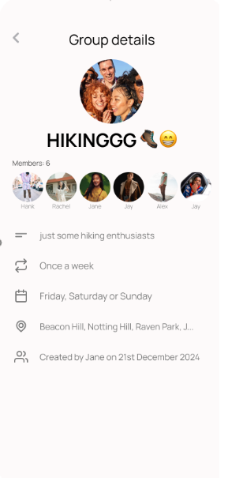

# frontend-takehome-exercise
Take-home exercise for Frontend Position, ReactNative

## Task 1: Build a Reusable Avatar Component

Create a reusable Avatar component with the following requirements:

- **Profile Image**: Must accept a profile image URL as a prop
- **Fallback to Initials**: If no image is provided, display the user's initials (from a `name` prop)
- **Shape**: Circular shape
- **Size Prop**: Support a `size` prop with three options: `small`, `medium`, `large`
- **Online Badge**: Include an optional "online" badge that appears on the bottom right edge of the circle

## Task 2: Recreate Screen in React Native

Recreate the screen shown below in React Native. Use the Avatar component from Task 1.

*Note: Screen image will be provided*
